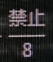
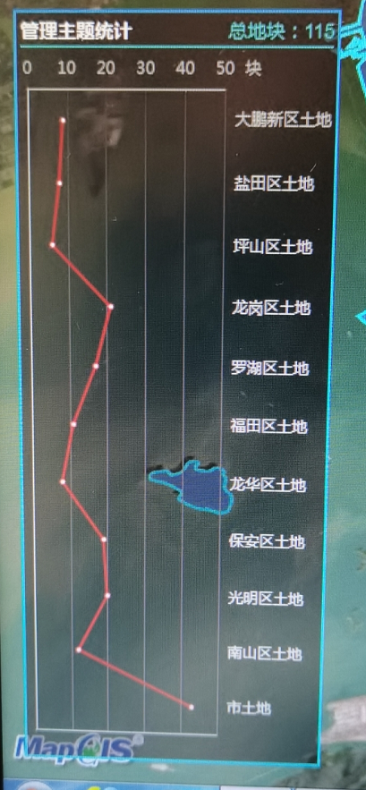
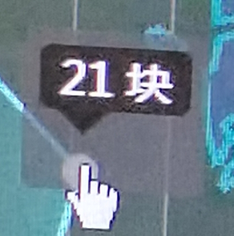
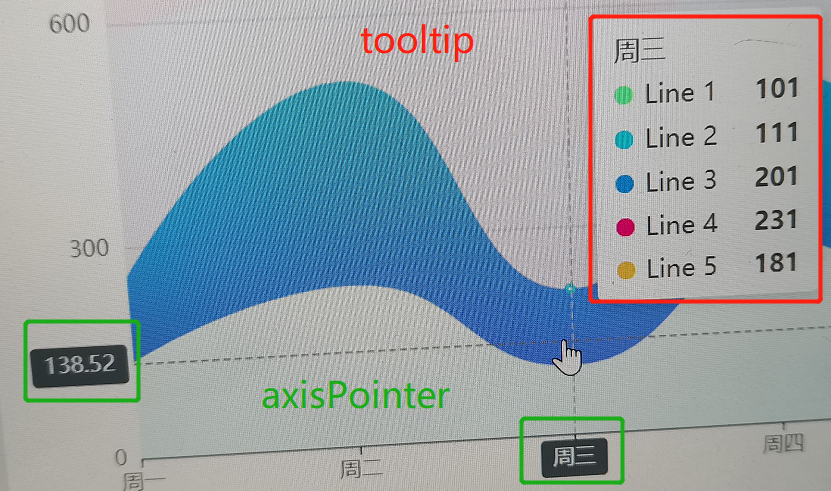

### formatter
介绍 `内容格式器`-`字符串模板` 的用法


- `{a|{b}}` 即名为` a` 的盒子；

- `\n` 即换行；

- `{hr|}` 即名为 `hr` 的盒子；

- `{b|{c}}` 即名为` b` 的盒子；

在 `rich`分别设置3个盒子的样式。

```javascript
label:{
    formatter:'{a|{b}}\n{hr|}\n{b|{c}}',
    rich:{
        a:{
            aligin:'center',
            color: this.scssVariables.grauyText
        },
        hr:{
            height:1,
                width:'100%',
                height:1,
                backgournd: this.scssVariables.grauyText
        },
        b:{
            align:"center",
            color: this.scssVariables.grauyText
        }
    }
}
```

### 多个坐标轴
介绍给图标添加多个坐标轴。



如下图所示有2个横轴，2个纵轴。
- 有2个 横|纵 轴就添加2个对象，代表2个坐标轴
- 设置 `类别(category)`、`数值(value)` 轴线
- `xAxisIndez` `yAxisIndex`选中设置的轴线
```javascript
xAxis:[
    // 下侧横轴，inde=0
    {
    },
    // 上侧横轴，index=1
    {
        // 将本轴作为数值展示轴线
        type:'value',
    }
],
yAxis:[
    // 左侧坐标轴，index=0
    {
    },
    // 右侧坐标轴,index=1
    {
        // 将本轴作为分类轴
        type:'category',
        // 类别
        data:this.division
    }
],
series:[
    {
        data:this.data, // 每项对应的数值
        xAxisIndez:1,   // index=1的横轴为数值轴，所以为1
        yAxisIndex:1    // inde=1的纵轴为分类轴，所有为1
    }
]
```

### tooltip设置



```javascript
tooltip:{
    // 回调函数中设置内容
    formatter:function (params){
        return `
            <div class="toolTip">
                <div>
                    ${params.value} 块
                </div>
            </div>
        `
    },
    // point是鼠标位置
    position:function(point){
        return [point[0]-18;point[1]-40]
    },
    // tooltop的内容默认是放在一个dom中，默认背景色为灰色
    // 如果不想要该背景色，则将其设置为透明
    backgroundColor:'rgba(0,0,0,0)'
}
```
```scss
.toolTip{
  & div:nth-child(1){
    background-color: #000;
    padding: 0px 6px;
    border-right: 4px;
  }
  &::after{
    content:'';
    position: relative;
    border: 10px solid;
    border-color: #000 transparent transparent;
    top: 7px;
    left: -10px;
  }
}
```

### tooltip 和 axisPointer
`toolTip`是提示框，`axisPoint`是坐标轴指示器
坐标轴的标签无法动态更改样式，可以利用axisPoint来达到改变坐标轴标签的样式：例如，axisPoint文体覆盖坐标轴文本。axisPointer可以在多个个地方配置。
```javascript
option:{
    tooltip:{
        axisPointer:{}
    },
    xAxis:{
        axisPointer:{}
    },
    yAxis:{
        axisPointer:{}
    },
    // 适用于饼图、雷达图
    radiusAxis:{
        axisPointer:{}
    }
}
```


### 雷达图tooltip显示单个数据项

[echarts雷达图显示单个数据的tooltip](https://blog.csdn.net/weixin_44634366/article/details/108872578)

**需求:** tooltip中只展示当前维度的数值

正常情况下，雷达图的tooltip会同时显示所有维度的数据。
同时，即使在 `formatter`的回调函数，并不会单独提供单前选中维度的数值，因此无法确切得知当前维度的数值。

**解决办法:**
有 `n` 个维度则设置 `n+1` 个系列。


```javascript
option:{
    tooltip:{
        formatter:function(params){
            // value是一个数组,包含 维度1、维度2、维度3 的所有维度数据；
            // 在一个系列中，只设置一个系列有值，其他系列为null,则当触发toolTip时，不为null的值就是当前选中维度的值。
            let value = null
            params.value.forEach(item=>{
                if (item !== null){
                    value = item
                }
            })
            
            return `
                <div>
                    <div>
                        ${value}
                    </div>
                </div>
            `
        }
    },
    radar:{
        indicator:['维度1',"维度2","维度3"]
    }

    series:[
        // 第一个系列所有的维度上都有值;
        // 要展示完整的雷达图形，需要完整的数据;
        // 不显示该系列的tooltip，因为该tooltip无法确定当前选中的维度值;
        {
            type:'radar',
            tooltip:{
                show:false
            },
            data:{
                value:[100,90,80]
            }
        },
        
        
        // 1. 其他n个系列，成阶梯状设置一个维度上有值；
        //   [
        //       [维度1, null, null], // 系列a
        //       [null, 维度2, null], // 系列b
        //       [null, null, 维度3]  // 系列c
        //   ]
        //   如上维度1为例: 
        //              当选中维度1时，只有系列a在该维度有值，才会会触发tooltip,其他系列在该维度为null,不会触发tooltip;
        //              系列a触发tooltip时,回调函数中value值[维度1, null, null],通过判断是否为null来确定维度1的值。
        // 2. 因为数据不完整，雷达图形变形，设置图形透明，不显示图形；
        // 3. 需要显示tooltip；
        // 4. 注意通过z将系列放在上面，否则被第一个被第一系列的雷达图形覆盖，无法触发tooltip
        
        {
            type:'radar',
            lineStyle:{
                color:"transparent"
            },
            itemStyle:{
                color:"transparent"
            },
            z:99,
            data:{
                value:[100,null,null]
            }
        },
        {
            type:'radar',
            lineStyle:{
                color:"transparent"
            },
            itemStyle:{
                color:"transparent"
            },
            z:99,
            data:{
                value:[null,90,null]
            }
        },
        {
            type:'radar',
            lineStyle:{
                color:"transparent"
            },
            itemStyle:{
                color:"transparent"
            },
            z:99,
            data:{
                value:[null,null,80]
            }
        }
    ]
}
```

### 事件与行为
[ECharts中的事件和行为](https://blog.csdn.net/wilson_m/article/details/81332659?utm_medium=distribute.pc_relevant.none-task-blog-baidujs_title-6&spm=1001.2101.3001.4242)
