## 1. 资金大幅流入
资金流入有两种模式，升
### `DOGE`
涨幅24%

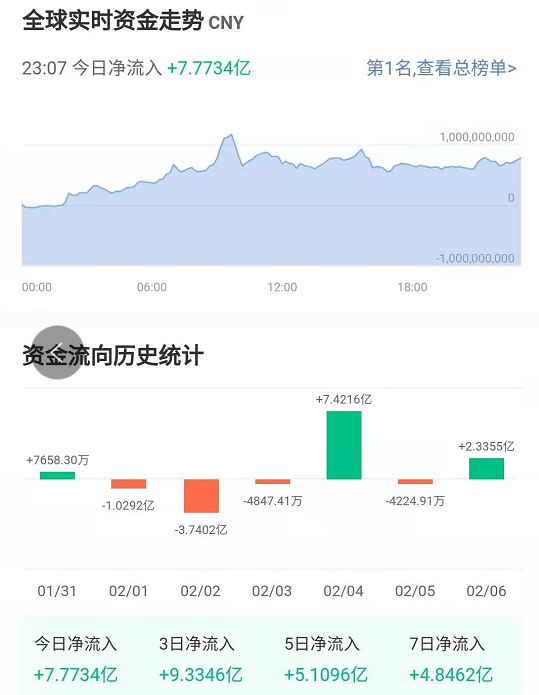
------

### `ADA`
涨幅21%

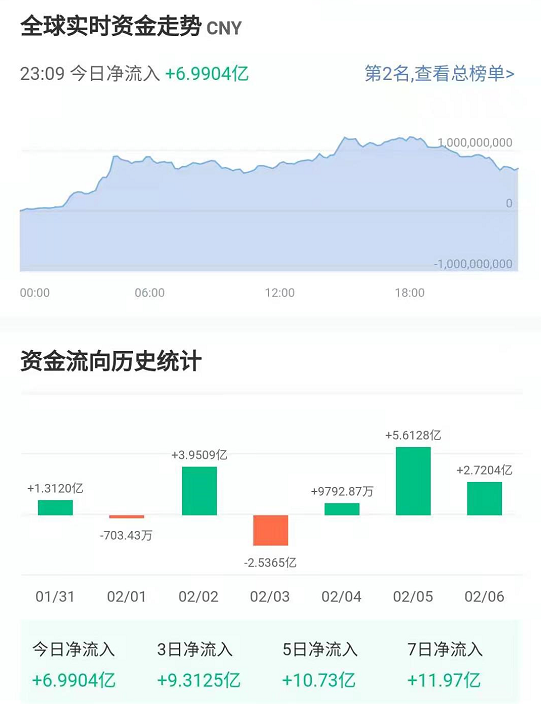
------

### `HT`
涨幅12%

------

### `XLM`
涨幅12%

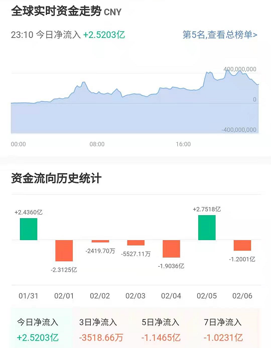
------

### `QTUM`
涨幅15%

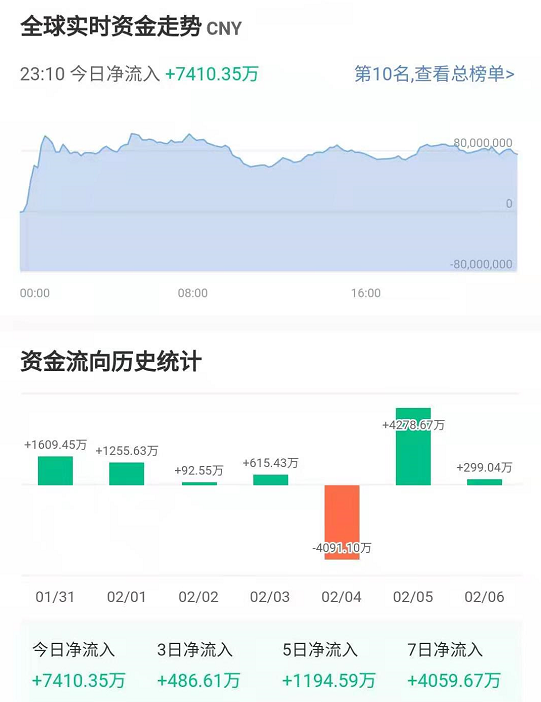
------

### `ICX`
涨幅14%

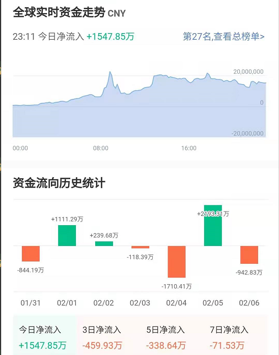
------

### `ALGO`
涨幅9%

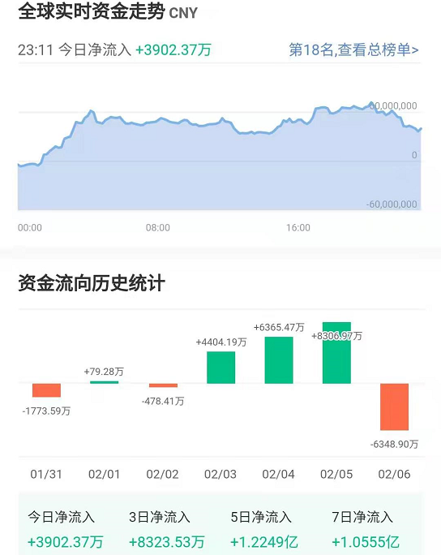
------

### `SNT`
涨幅9%

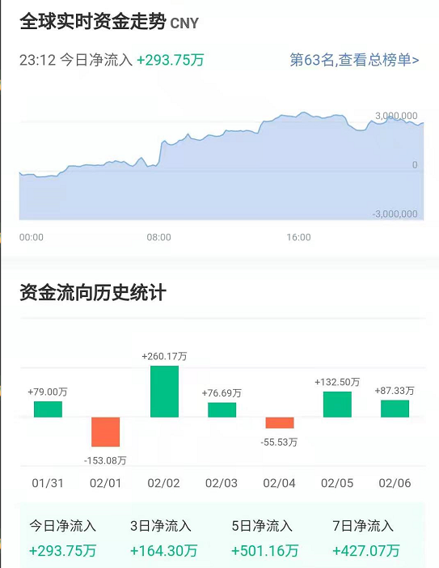
------

### `MKR`
涨幅6%

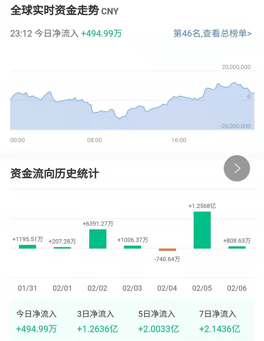
------

### `GRT`
升幅5%

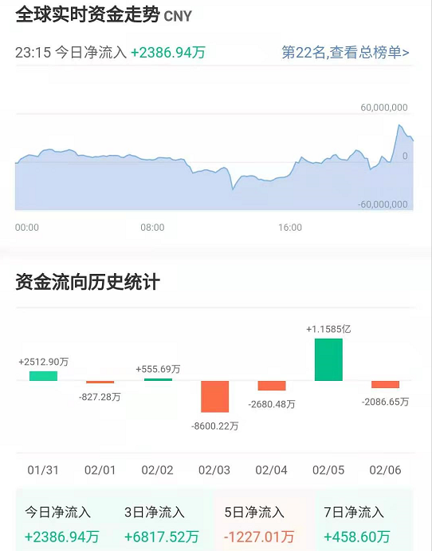
------

### `MKR`
升幅7%

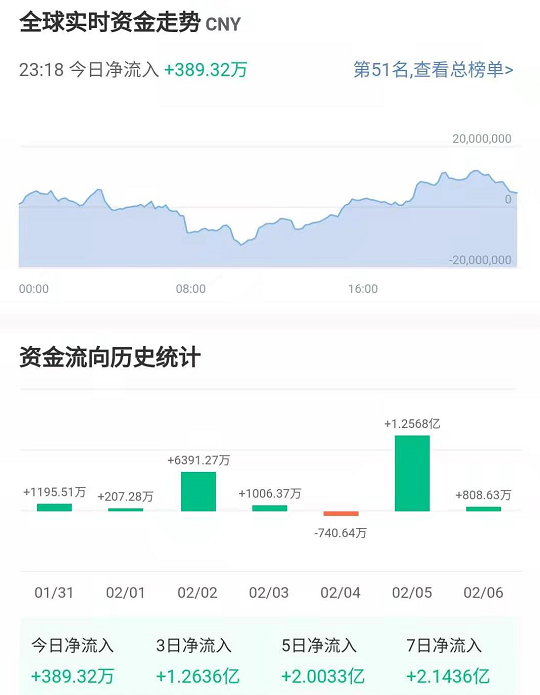
------

## 2. 资金净流出
### `MANA`
涨幅26%

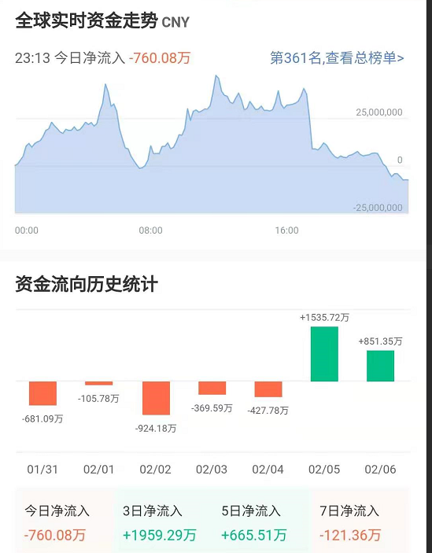
------

### `BCH`
升幅1%

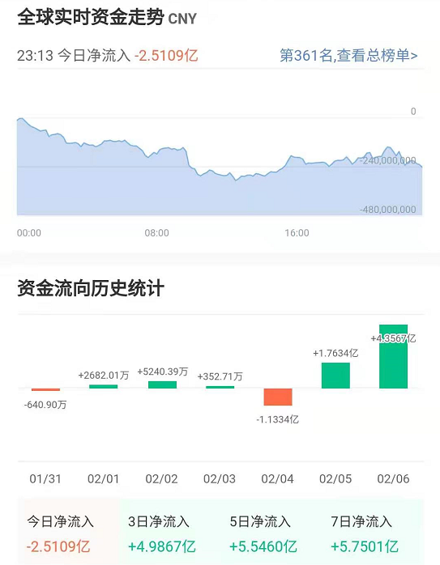
------

### `SC`
升幅3%

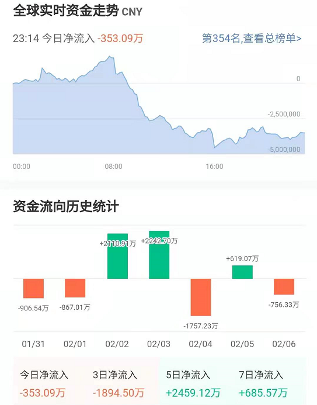
------

### `BNB`
升幅3%

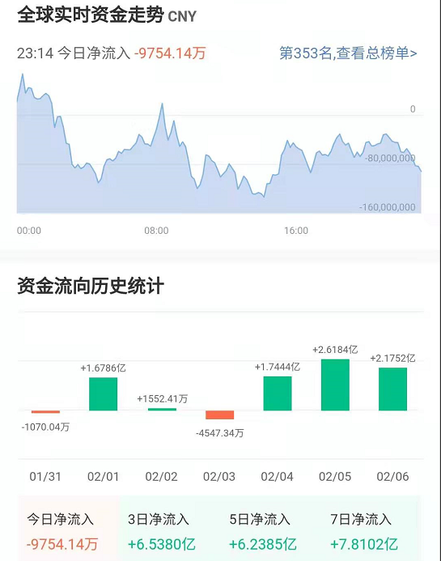
------

### `UNI`
升幅2%

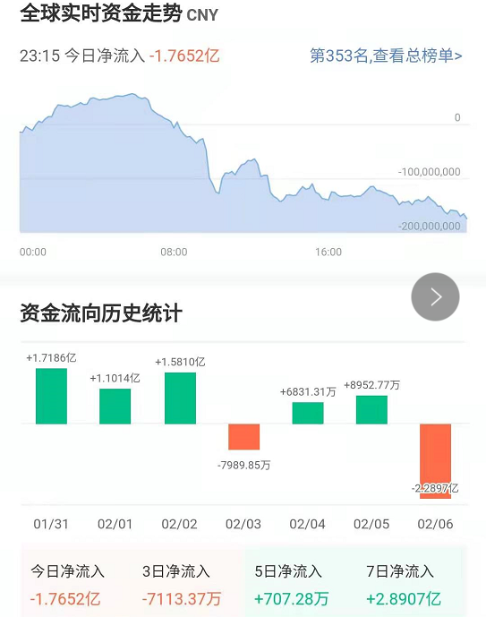
------

### `AAVE`
升幅4%

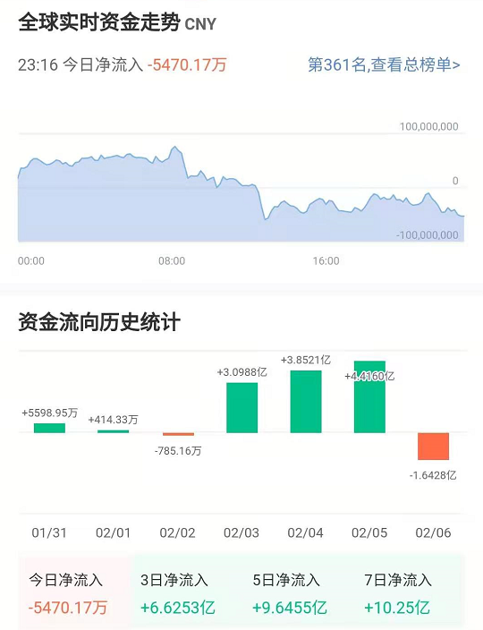
------

### `RSR`
升幅3%

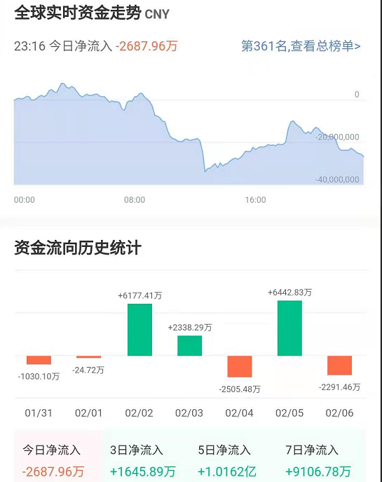
------

### `LRC`

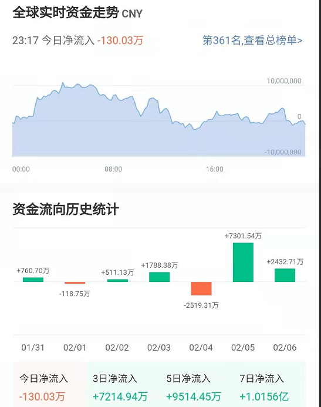
------

### `CRV`
升幅3%

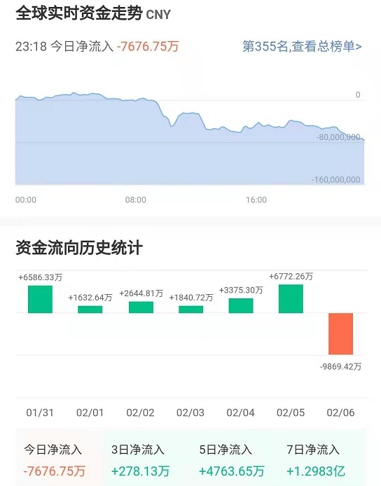
------

### `ZRX`
升幅9%

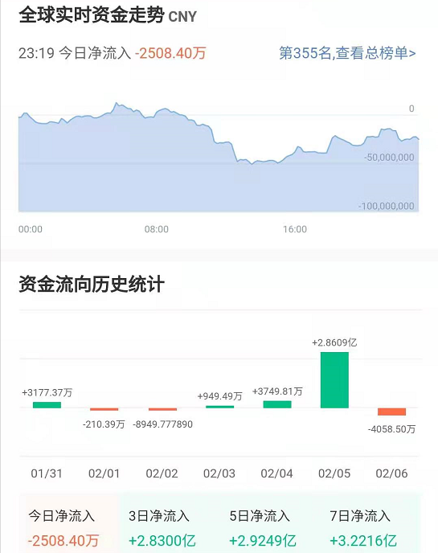
------

### `COMP`
升幅5%

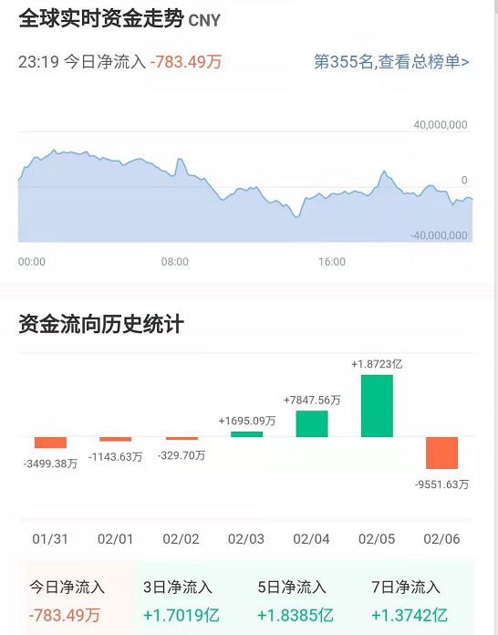
------

### `1INCH`
升幅4%

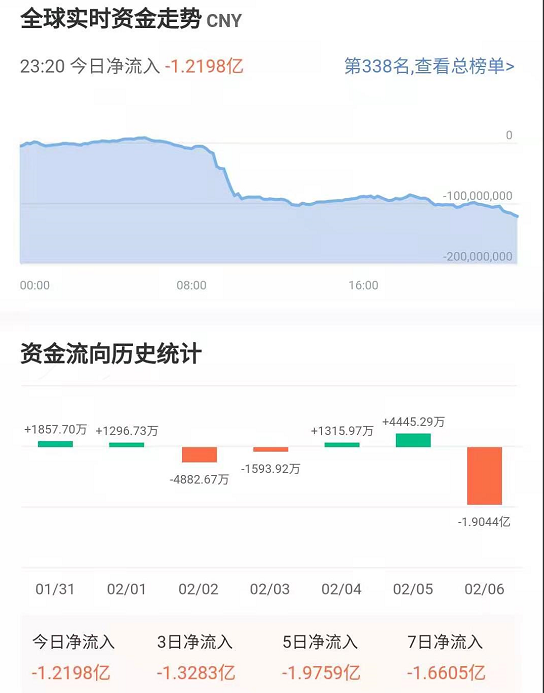
------

### `REN`
升幅3%

